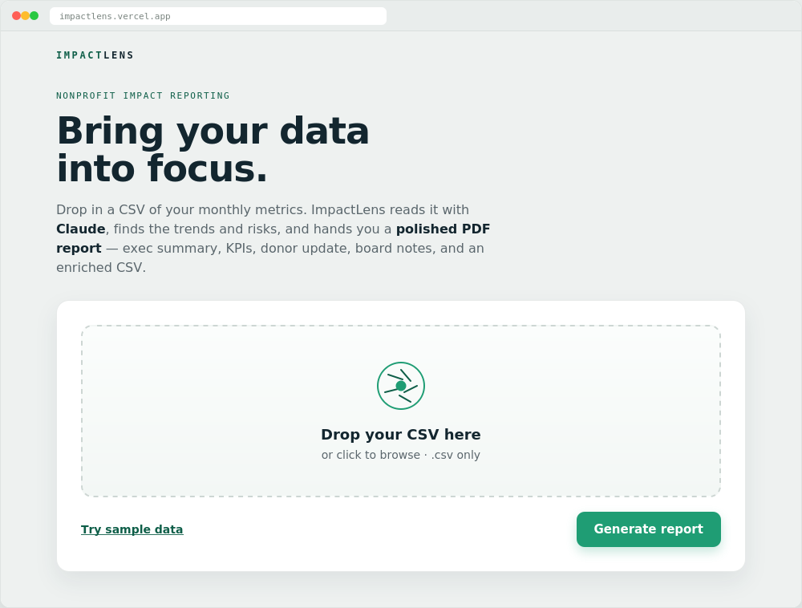
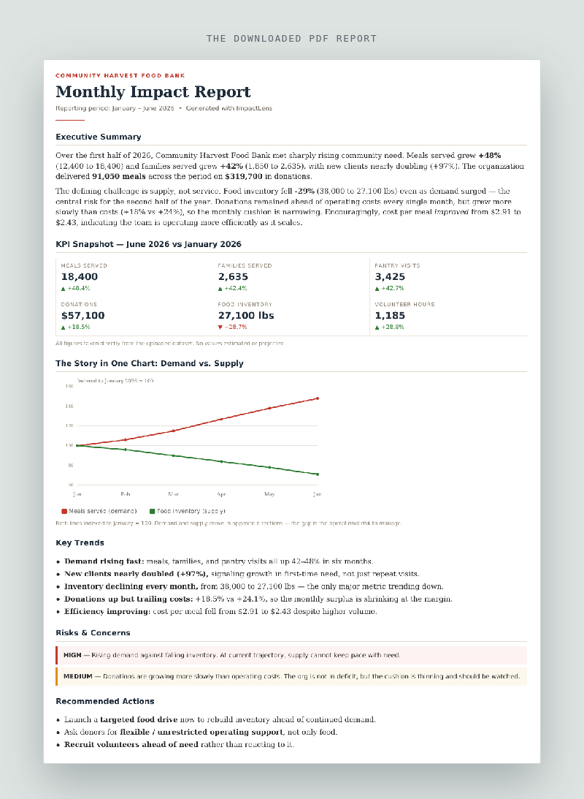

# ImpactLens — Demo

**Turn a nonprofit's spreadsheet into a board-ready PDF impact report in seconds.**

A nonprofit uploads a CSV of their monthly numbers. ImpactLens reads it with Claude, finds the
trends and risks, and hands back a polished PDF report — executive summary, KPIs, donor update,
board notes, and an enriched CSV. No spreadsheets to wrestle, no analyst required.

---

## The problem

Nonprofits sit on useful data — meals served, donations, volunteer hours — but turning it into
a board report or a donor update takes hours of manual work every month. Most small teams don't
have a data analyst to do it.

## What ImpactLens does

You drop in a CSV. It does the rest.

---

## 1. Upload your data

Drag in a `.csv` (or click **Try sample data** to test it instantly). One row per month is all
it needs.

## 2. Claude analyzes it

Behind the scenes, the Claude API reads the file, compares the first month to the latest, spots
the trends, and flags risks — using **only the numbers in your file**. It never invents figures.

## 3. You get a full report on screen

Executive summary, a KPI snapshot with month-over-month change, color-coded risk flags, a warm
donor update, and a board summary — all generated from your data.

## 4. Download the PDF (and an enriched CSV)

One click gives you a clean, shareable PDF with a chart that tells the story at a glance.

You also get your original CSV back with five new AI-generated columns: `ai_summary`,
`risk_level`, `recommended_action`, `donor_message`, and `board_note`.

---

## How it's built

- **Next.js** single-page web app
- **Claude API** for the analysis and writing
- **jsPDF** to build the report in the browser (so it runs on free hosting)
- Your API key stays server-side — never exposed to visitors

## Try it yourself

1. Clone this repo and run `npm install`
2. Add your Claude API key to `.env.local` (see `.env.example`)
3. `npm run dev` and open the local link — or deploy free on Vercel in a few clicks
   (full steps in the README)

---

## Companion: the Claude Skill

The same workflow is also packaged as a reusable **Claude Skill** (`impact-report`), so you can
run it directly inside Claude without a website. See the separate skill repo.

> Note: the numbers and screenshots above use a fictional food bank, *Community Harvest*, as a
> demo. Every figure in a real report comes only from the data you upload.
